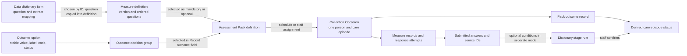
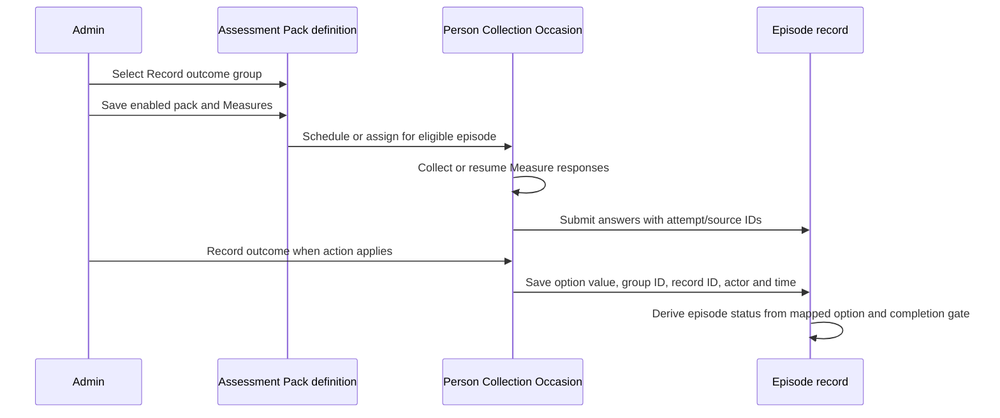
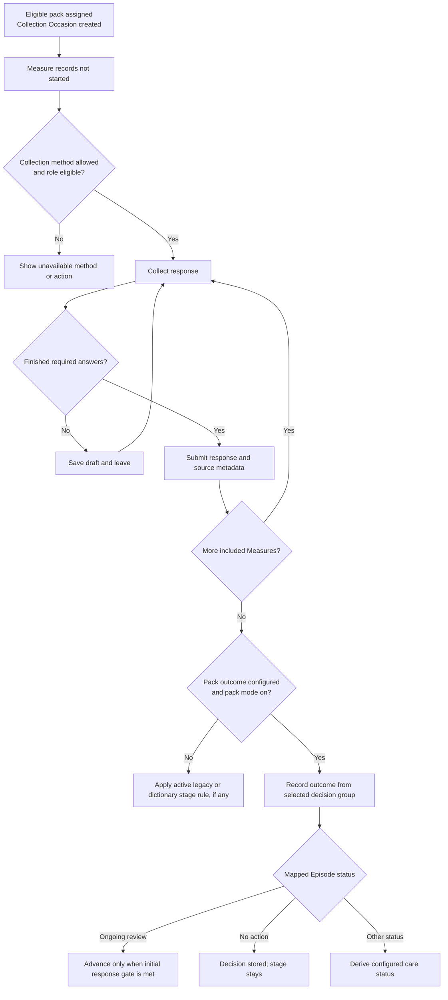

# Developer handoff: Administration, Assessment Packs, Measures, Data dictionary and outcomes

**Current prototype snapshot:** 6 October 2026. This document describes the implementation in `YSCC_Prototype_2`, including its current feature switches and browser-local data model. A user's saved browser settings may differ from the defaults in source. Terms such as “must” below describe current validation or interaction behavior, not an approved clinical policy.

## 1. What the four configuration areas own

| Administration area | Owns | Used by | Important boundary |
| --- | --- | --- | --- |
| **Data dictionary** | Question identity, display label, hAPI question, extract variable, data item, response coding and derived fields | Measure editor, pack conditions, optional dictionary-driven stage rules | An extract mapping is not itself a submitted response. A new dictionary item starts as a draft. |
| **Measures** | A named, versioned, ordered set of questions, respondent support and availability | Assessment Packs and response collection | A Measure is a questionnaire definition. A response is a separate person/episode record pinned to a measure version. |
| **Assessment Packs** | A named set of Measures, respondent and allowed collection methods, timing, eligibility and an optional outcome group | Scheduling and person-level Collection Occasions | A pack is a reusable definition. It does not contain the person’s answers or outcome. |
| **Outcome options** | Decision groups, option names/codes, enabled state and the resulting episode status | The **Record outcome** control when pack-based outcomes are on | The chosen group limits the options shown for that pack. An option's status mapping determines the resulting care status. |

In the UI, open **Administration → Assessment Packs**, **Measures**, **Data dictionary**, or **Outcome options**. **Record outcomes** is a separate tab for the older status-transition and Data dictionary modes; it is hidden when **Record outcome from Assessment Packs** is enabled. The **Statuses** tab is a reference inventory. See [`Operations.jsx`](../src/features/Operations.jsx), [`AssessmentFeatures.jsx`](../src/features/AssessmentFeatures.jsx), and [`AssessmentScheduleSettings.jsx`](../src/components/AssessmentScheduleSettings.jsx).

The dotted path is an **alternative mode**. A dictionary stage rule matches submitted answers and requires staff confirmation; it is not an outcome decision group and does not populate a pack’s outcome dropdown.

## 2. Data dictionary: source definitions and dependencies

The catalogue combines built-in Measure questions, codebook extract fields, calculated/derived extract fields, and browser-created draft items. Its UI shows the item/question, hAPI question, Measure, extract variable, data item, extract type and expandable coding. Search spans question IDs, names, Measure names, extract fields and coding. Filters cover all, linked, unmapped and derived entries, plus a Measure filter. Derived fields are in the same catalogue; the codebook Batch is an internal match key and is not exposed as a table filter. See [`AdminDataDictionary.jsx`](../src/components/AdminDataDictionary.jsx) and [`dataDictionaryCatalog.js`](../src/dataDictionaryCatalog.js).

### Editing and adding

1. **Edit a built-in item** changes its extract metadata override: variable name, data item, hAPI question, extract type and format/coding. The original mapping can be restored. This edits the browser’s mapping overlay; it does not rewrite the bundled codebook or the text of an already published questionnaire.
2. **Add item** creates a *draft dictionary question* with question label, optional alt text/description and extract mapping. It appears in the catalogue immediately. Its dialog explicitly says to add it to a Measure from the Measure editor; adding the dictionary row alone does not publish a questionnaire.
3. **Enable/disable** controls new selections. Existing records and answers remain historical evidence. **Delete** hides the item from this browser’s catalogue and new field choices. The confirmation lists dependent pack parameters and stage-change rules, but currently permits deletion and says those links become invalid; developers should preserve and surface that dependency behavior in any production model.

The dictionary catalogue creates stable row IDs such as `measure-version:question-id:index`, `derived:batch:variable`, or `draft:<uuid>`. Pack conditions and dictionary stage rules store the row ID, not a label. Codebook matching uses Batch plus variable internally. A draft used by a Measure remains identifiable through `dictionaryRowId`. See [`dataDictionaryCatalog.js`](../src/dataDictionaryCatalog.js), [`AdminMeasureEditor.jsx`](../src/components/AdminMeasureEditor.jsx), and [`ProfileValueTriggerFields.jsx`](../src/components/ProfileValueTriggerFields.jsx).

### Important implementation nuance

When a dictionary item is selected for a new Measure, the editor constructs a Measure question from the item and stores its `dictionaryRowId`. It copies the current wording and response format into the Measure definition. Do not assume later extract-mapping edits automatically migrate existing questions or submitted answers. A production implementation needs explicit versioning, migration rules and provenance for changes to question text, coding or extract variables.

## 3. Measures: questionnaire definitions

**Administration → Measures** lists each Measure’s name and ID/version, question count, availability, associated Assessment Packs, create/modified dates and a question disclosure. Staff can search by name, version/ID or pack; filter by Available, Other pathway and Disabled; preview; add; and edit. Availability limits future choices, rather than deleting historical responses. See [`AdminInstrumentsTable.jsx`](../src/components/AdminInstrumentsTable.jsx) and [`catalogAvailability.js`](../src/catalogAvailability.js).

The Add/Edit Measure dialog requires a name and at least one Data dictionary item. A new Measure receives a generated version based on its name. The user searches dictionary items, adds them to an ordered list, can reorder them and save. Existing source questions are kept in the edit form; newly added questions can be removed before save, while the editor does not expose removal for questions already in the Measure. The editor currently saves Measure definitions separately from the main workspace state. See [`AdminMeasureEditor.jsx`](../src/components/AdminMeasureEditor.jsx) and [`instruments.js`](../src/instruments.js).

**Developer contract:** use the Measure version as the reference from a pack and from each response record. Keep question IDs and source dictionary IDs with the response snapshot. A renamed Measure or changed mapping must not silently reinterpret answers collected under an earlier version.

## 4. Outcome decision groups and their interaction with packs

In **Administration → Outcome options**, a decision group is a named container for outcome options. The built-in default group is **Initial assessment**; current seed/upgrade logic also supplies **Profiling**, **Ongoing review** and **Discharge** groups. A group can be renamed; the default cannot be removed. A non-default group can only be removed when it has no options and no pack references. See [`outcomeDecisionGroups.js`](../src/outcomeDecisionGroups.js), [`AdminOutcomeDropdownOptions.jsx`](../src/components/AdminOutcomeDropdownOptions.jsx), and the reducers in [`model.js`](../src/model.js).

Each outcome option has a **stable stored value**, user-facing label, optional code, enabled switch and **Episode status** mapping. Status may be **No action** or one of the supported display statuses. A newly added custom option defaults to No action unless changed. The same option name cannot repeat within a group; a name reused in another group must keep the same code. Editing a label does not rewrite previously recorded values. Disabling an option removes it from new choice lists; an already recorded value remains visible as “previously recorded” when editing an outcome. The built-in Batch 2 assessment-outcome choices are part of the default group. See [`assessmentOutcome.js`](../src/assessmentOutcome.js), [`outcomeEpisodeStatus.js`](../src/outcomeEpisodeStatus.js), and [`AssessmentOutcomeForm.jsx`](../src/components/AssessmentOutcomeForm.jsx).

In every Assessment Pack editor, **Record outcome** is a selector:

- **No outcome needed or recorded** sets `recordOutcome` to false. No pack-based Record outcome action is applicable.
- Choosing a group sets `recordOutcome` to true and saves `outcomeGroupId`. The selector shows the count of options in each group.
- When **Record outcome from Assessment Packs** is on, the selected group supplies only its *enabled* options in the person’s Record outcome dialog. The reducer rejects a value outside that group, even if it is valid in another group.
- Each option’s Episode status setting controls the downstream derived status; **No action** records a decision without moving the stage. An Ongoing review decision is gated by completion of the relevant initial assessment measures when the stage is derived.

The group is configuration on the **pack definition**. The saved decision belongs to a **person, episode and pack/collection record**. The reducer stores `value`, `groupId`, `recordId`, timestamp and recording staff in `episode.packOutcomes`, and also maintains `episode.packOutcome` as the latest outcome. Previous per-pack outcomes remain in the array, and the response view resolves the outcome for its own Collection Occasion. See [`assessmentPackOutcome.js`](../src/assessmentPackOutcome.js), [`assessmentOutcome.js`](../src/assessmentOutcome.js), and `RECORD_PACK_OUTCOME` in [`model.js`](../src/model.js).

**Review point for developers:** the Record outcome action can be shown before the initial assessment is fully answered, and `RECORD_PACK_OUTCOME` itself does not require every Measure to be submitted. The transition to Ongoing review has a separate completion gate. Avoid equating “outcome saved,” “all responses submitted” and “pack completed” in data or UI logic. The latest `episode.packOutcome` also has special weight in status derivation, so multi-pack ordering and historical status need careful testing. A group with zero enabled options can be selected in Administration; the person action is then disabled because it has nothing to offer.

## 5. Creating and editing an Assessment Pack

**Administration → Assessment Packs → Add Assessment Pack** opens the shared editor. Editing an existing pack uses the same identity, collection, conditions and Measure concepts. Client profile, stream-specific initial assessment and 90-day review system packs have dedicated edit forms, while custom packs use the general editor. See [`AssessmentScheduleSettings.jsx`](../src/components/AssessmentScheduleSettings.jsx), [`AssessmentPackEditorLayout.jsx`](../src/components/AssessmentPackEditorLayout.jsx), [`ClientProfileBundleEditor.jsx`](../src/components/ClientProfileBundleEditor.jsx), [`MvpInitialBundleEditor.jsx`](../src/components/MvpInitialBundleEditor.jsx), and [`MvpReviewBundleEditor.jsx`](../src/components/MvpReviewBundleEditor.jsx).

### Configuration fields, in screen order

1. **Identity and availability.** Enable the pack; enter a unique Assessment Pack name (up to 80 characters); choose its Record outcome group or no outcome. A disabled pack remains a definition but is unavailable for new scheduling/collection.
2. **Collection.** Choose the respondent (Patient/young person or Clinician). Choose **Any** collection method or a non-empty allowed set. Available methods include Clinic tablet, Clinician entry and SMS link when SMS collection is enabled. Clinician respondent uses Clinician entry. The saved planned method must be among the allowed choices. The person-level collection setup only offers allowed methods. See [`AllowedCollectionMethods.jsx`](../src/components/AllowedCollectionMethods.jsx) and [`allowedCollectionMethods.js`](../src/allowedCollectionMethods.js).
3. **Timing/care point.** In the current MVP presentation, named presets include New profile, Assessment, recurring 90-day review, Discharge and other status changes. The 90-day review is the recurring preset; the other named care points prepare once. In the flexible editor, a pack can use event, date or days-after-trigger scheduling. A days trigger can refer to a selected Assessment Pack and its assessment status, a care episode status, program/care-level change or other supported events. Existing saved trigger types are retained for compatibility. See [`mvpAssessmentPathway.js`](../src/mvpAssessmentPathway.js), [`AssessmentScheduleSettings.jsx`](../src/components/AssessmentScheduleSettings.jsx), and [`measureTriggers.js`](../src/measureTriggers.js).
4. **When this pack applies.** Set program stream and optionally care level, minimum/maximum age and a **Data field** parameter. The Data field picker is sourced from the Data dictionary and stores a field ID plus matching value. Removing a parameter changes future matching; it should not erase an already collected response. See [`ProfileValueTriggerFields.jsx`](../src/components/ProfileValueTriggerFields.jsx) and [`profileValueTriggers.js`](../src/profileValueTriggers.js).
5. **Measures.** Add at least one enabled, respondent-compatible Measure. Order the list and mark general-editor items Mandatory or Optional. Mandatory items are included in a Collection Occasion; optional items are chosen at person level. System pack editors may use fixed stream/respondent constraints and mandatory batteries.
6. **Save.** Validation checks name, schedule/eligibility, collection method, Measure identity/compatibility and required fields. The general editor commits `SAVE_ASSESSMENT_SCHEDULE_RULE`; dedicated forms commit their corresponding pack action. Saving a definition is distinct from creating a person’s Collection Occasion. See [`assessmentBundles.js`](../src/assessmentBundles.js) and [`model.js`](../src/model.js).

### Definition versus Collection Occasion

The person’s **Assessment Pack** tab turns an enabled matching definition into a **Collection Occasion**: a named instance linked to one person and care episode, containing Measure records. A manually added instance can choose optional Measures and extra compatible Measures, specify a due date where scheduling is on, and adjust delivery within the pack’s allowed methods. The instance keeps its selected Measure versions and response records; subsequent definition changes must not rewrite submitted responses. See [`NewAssessmentBundle.jsx`](../src/components/NewAssessmentBundle.jsx), [`assessmentBundles.js`](../src/assessmentBundles.js), and [`sampleAssessmentBundles.js`](../src/sampleAssessmentBundles.js).

The current MVP path starts the initial assessment immediately after Client profile completion, subject to its configured/eligible pack. The stream-specific initial pack contains young-person Measures. The review pack is clinician-facing and normally prepares a 90-day review after initial assessment completion while the episode is active. These are source defaults and settings-dependent behavior, not clinical cadence approval. See [`mvpAssessmentPathway.js`](../src/mvpAssessmentPathway.js).

## 6. Outcome collection and status lifecycle

The **Collect response** action opens the existing collection setup. The chosen method, respondent, recorder/assistance and response source belong to the attempt, not merely to the pack. A draft may be resumed. Submission records answer values, submitted time, attempt and per-answer source IDs; a clinician review may remain pending after submission. Response collection does not silently create a contact or record an outcome. See [`Forms.jsx`](../src/components/Forms.jsx), [`BundleQuestionnaire.jsx`](../src/components/BundleQuestionnaire.jsx), [`responseSessions.js`](../src/responseSessions.js), and [`Person.jsx`](../src/features/Person.jsx).

For the initial assessment, the configured Record outcome action may be available while Measures are still being collected. In the legacy assessment-outcome path, a submitted set without a saved outcome remains **In progress / Record outcome** in the pack view, and Ongoing review requires both all relevant young-person Measures submitted and a recorded proceeding outcome. In pack mode, a saved proceeding outcome does not waive that response gate. For recurring reviews, show **Collect response**; show **Record outcome** only when an applicable pack or transition is configured. Status badges derive from response, due and outcome state, rather than from a manually typed pack status. See [`assessmentBundleStatus.js`](../src/assessmentBundleStatus.js), [`assessmentOutcome.js`](../src/assessmentOutcome.js), and [`measureStatusChange.js`](../src/measureStatusChange.js).

### Alternative: Data dictionary values drive a stage confirmation

When **Assessment features → Link stage changes to Data dictionary values** is enabled and pack-based outcomes are off, **Administration → Record outcomes** lists status changes such as Profiling → Assessment and Assessment → Ongoing review. An administrator adds one or more dictionary-item/value conditions to a transition; **every condition must match**. Rules cannot repeat a field within one transition, and an enabled rule needs at least one condition. The matching logic reads the latest submitted answer for a Measure question when available and can use supported profile/derived values. See [`DictionaryStageOutcomeOptions.jsx`](../src/components/DictionaryStageOutcomeOptions.jsx) and [`dictionaryStageOutcomes.js`](../src/dictionaryStageOutcomes.js).

This mode never silently changes stage from a questionnaire answer. Staff see the matched values and explicitly **Confirm stage change**, below a completed assessment question or in the person-level outcome context. The reducer requires a completed transition, matching values, a clinician-entry collection channel, an active editable episode and appropriate role access. It rejects tablet/SMS collection for this confirmation. Assessment → Ongoing review additionally requires the initial response completion gate. The saved `statusOutcomes` entry records the source as `Data dictionary`, its condition snapshot, transition, actor and time. See [`DictionaryStageConfirmation.jsx`](../src/components/DictionaryStageConfirmation.jsx), [`BundleQuestionnaire.jsx`](../src/components/BundleQuestionnaire.jsx), and `CONFIRM_DICTIONARY_STAGE_OUTCOME` in [`model.js`](../src/model.js).

## 7. Permissions, persistence and implementation risks

- **Roles.** The reducer checks `record_outcome` access and active/editable person and episode state. Staff access is assignment and visible-stage scoped; their collection access is further limited to young-person recipient packs. Clinicians and General Managers have broader pack access. Keep server authorization aligned with the UI if this is rebuilt beyond the prototype. See [`accessPolicy.js`](../src/accessPolicy.js).
- **Persistence.** Workspace settings, people and outcomes are saved to `localStorage` under `yscc-prototype-v1`; dictionary overlays/drafts/availability and added Measures use separate browser keys. A successful UI save is browser-local, with no multiuser synchronization, backend transaction, live SMS delivery or external extract submission. See [`store.jsx`](../src/store.jsx), [`model.js`](../src/model.js), [`dataDictionaryCatalog.js`](../src/dataDictionaryCatalog.js), and [`administrationMeasures.js`](../src/administrationMeasures.js).
- **References.** Preserve distinct IDs for dictionary row, Measure version, pack definition, Collection Occasion, Measure record, response attempt, outcome option and outcome record. Names and labels are presentation fields. Preserve the actor and timestamp for every outcome and revision.
- **Deletion and revisions.** Existing responses survive Measure disable/removal. Dictionary deletion warns about dependent conditions but can invalidate them. Outcome option disable hides new selection but retains existing values. A production migration should prohibit dangling references or explicitly version and repair them.
- **Mode switches.** `packBasedRecordOutcomes` takes precedence over the legacy assessment/status-outcome actions and dictionary confirmation. `dictionaryStageOutcomes` is used only when pack mode is off. Keep these paths separate in UI and tests; enabling one switch should not produce two competing Record outcome actions.
- **Clinical policy.** Codebook values and sample schedules demonstrate a workflow. Confirm outcome-to-status mappings, incomplete assessment handling, recurrence, discharge decisions and extract semantics with clinical and operational owners before production use.

## 8. Developer verification checklist

1. Add a draft dictionary item; confirm it appears as unassigned; add it to a new Measure; confirm the Measure references that dictionary ID and previews the expected question.
2. Add a pack with a unique name, compatible Measure, collection methods, eligibility parameter and a named outcome group. Confirm only enabled Measures and permitted methods are offered at person level.
3. Add two options with the same name in different groups: their codes must match. Disable one option and confirm it disappears from new choices without hiding a historical recorded outcome.
4. Create a Collection Occasion; save a draft, resume and submit every included Measure; verify response attempts/source IDs and the pack status. Record an outcome and verify the group restriction, per-pack record link and derived status.
5. Test an outcome recorded before all initial Measures are submitted, an option mapped to No action, a non-proceed option, and a subsequent pack outcome. Inspect both current status and the older pack’s Show response view.
6. With pack mode off, test a dictionary stage rule with two matching values, a mismatch, and a tablet/SMS response. Only a completed clinician-entry match should allow staff confirmation.
7. Reload the browser after each saved setting and response. Recheck disabled/deleted dictionary dependencies, saved Measure versions, and role-scoped actions.

Focused source tests include [`outcomeEpisodeStatus.test.js`](../src/outcomeEpisodeStatus.test.js), [`assessmentPackOutcome.test.js`](../src/assessmentPackOutcome.test.js), [`dictionaryStageOutcomes.test.js`](../src/dictionaryStageOutcomes.test.js), [`allowedCollectionMethods.test.js`](../src/allowedCollectionMethods.test.js), [`dataDictionaryCatalog.test.js`](../src/dataDictionaryCatalog.test.js), and [`sampleAssessmentBundles.test.js`](../src/sampleAssessmentBundles.test.js). The browser route for the configuration review is `/administration`; the person-level behavior must also be checked on a representative record.

**Verification on 6 October 2026:** all 62 relative links (47 distinct source targets) in this document resolved. A focused `node --test` run of the six files above passed 17 of 22 tests. Five failed: `allowedCollectionMethods.test.js` could not initialize a circular import under Node 26 (`GENDER_OPTIONS` before initialization); one `outcomeEpisodeStatus.test.js` assertion expected a different prior pack outcome from the current sample state; and three `sampleAssessmentBundles.test.js` assertions expected older sample bundle fixtures. These failures were not caused by the documentation edit. They leave the relevant runtime paths requiring a fresh browser check before delivery claims are made.
